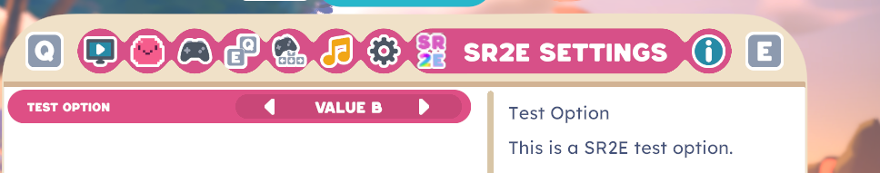

## SR2E 3.0.0 Beta 1

We're proud to anounce a beta version of SR2E!

It adds lots of new things. We hope you like it.

## Changelog:
Fixed a few bugs

New issues
- Option system improperly saves `Profile` settings.
- [INTENTIONAL] When putting the game in `DE` language, all sr2e text starts with "(In DE) " | This is just a place holder and will be actual german by `Beta 2`

Cheat Menu -> Added a "RemoveFog" button for the map UI (not permanent)
Cheat Menu -> Added a "BetterScreenshot" button to hide the UI while screenshoting

`util` command now supports changing emotions again!

New features were added: (Features marked with a `!` are togglable using the Flags system)
- `Flags System`
- SR2E Settings System
- Debugging stuff now inside the DLL instead of in a second file
- More languages support, `DE` is being created and will be ready by `Beta 2`
- `Auto Updater` (Togglable via Mod Menu)
- `Quick Start`
- `Save Fixer` Tries to fix saves broken which broke due to other mods, togglable via Mod Menu, VERY EXPERIMENTAL)
- a slider to the Create new save UI
- !`SR2EExpansions` (SR2E Modules, that depend on SR2E heavily, mostly developed by us)

Added the following commands:

- `toggleui`
- `recentercamera`
- `gadget`
- upgrade

Renamed/Combined/Improved commands:
- `givegadget` -> `gadget`
- `giveblueprint` -> `gadget`
- `giveupgrade` -> `upgrade`

Added commands that are hidden and have to be toggled on using the new flag system:
- `ranch`

### Documentation

We finally have XML Docs! This documentation is highly unfinished, so please add more into the `experimental` branch using `///` comments!

### New settings

SR2E now supports adding custom settings to the `Options` menus!

(yes thats correct we now have an official logo)

We have an option in the SR2E Category, but all it does is print to console.

However! There are 2 new official options that are fully working in the game! They are in the menu for creating a new save.
- "Allow Cheating" | "Give yourself the ability to spawn objects and edit your inventory."
- "Skip Intro" | "Whether or not to skip the intro cutscene when you begin the world."

### Languages

There is a new Language system that allows for not just english. It also allows the user to make their own translations from their own mods as well.

### Flags system

This system allows the user to edit parts of SR2E. You can find the **hidden** file here: `%appdata%/../LocalLow/MonomiPark/SlimeRancher2/`

These flags have been added:
- Dev
- - DevMode
- - DebugLogging
- - ShowUnityErrors
- - Experiments
- Commands + Dev
- - CommandsLoadDevOnly 
- - CommandsLoadExperimental 
- Commands
- - CommandsLoadCommands
- - CommandsLoadCheat
- - CommandsLoadBinding
- - CommandsLoadWarp
- - CommandsLoadCommon
- - CommandsLoadMenu
- - CommandsLoadMiscellaneous
- - CommandsLoadFun
- Cheats and Mods
- - AddCheatMenuButton
- - EnableInfHealth
- - EnableInfEnergy
- Misc
- - AddModMenuButton
- - AllowExpansions
- - EnableLocalizedVersionPatch
- - InjectSR2Translations
- - EnableIl2CppDetourExceptionReporting
- - CustomSettingsInjection
- Menus
- - EnableModMenu
- - EnableCheatMenu
- - EnableConsole
- UI
- - InjectMainMenuButtons
- - InjectRanchUIButtons 
- - InjectPauseButtons 
- Updates and Patches
- - CheckForUpdates
- - AllowAutoUpdate