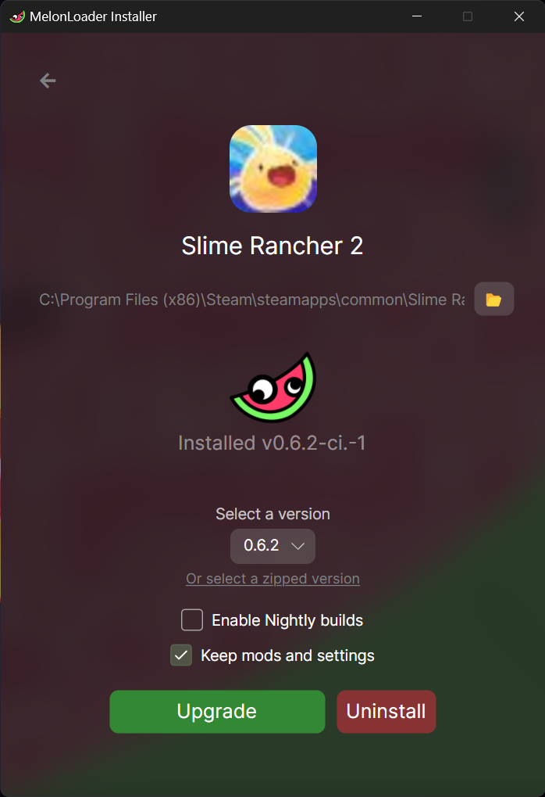
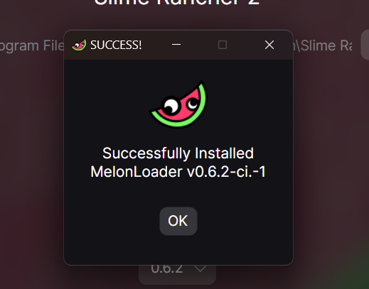

# Updating MelonLoader

You **need** to follow the installation guide beforehand!

## Gathering requirements

In this guide, we **need** the MelonLoader installer again. If you no longer have access to it or you don't know how to run it.
Go to your respective guide [Windows Installation Guide](/windows-installation-guide) or [Linux Installation Guide](/linux-installation-guide) and check how to
launch it.

## Updating MelonLoader

As mentioned before in the intro, SR2E **requires** MelonLoader in order to work. The screenshots were taken on a windows machine, but it will almost
identical on a linux machine.

1. Open MelonLoader
2. Select **Slime Rancher 2**. If you cant find it, you need to add the game manually.
:::tip Steam
If you want to, you can select a different version to downgrade/upgrade to it
:::
3. Select the **latest version** in the version dropdown and then **press Install**.

4. If everything went smoothly, it should get this message:

5. Simply press OK, close the installer and proceed to the next step
